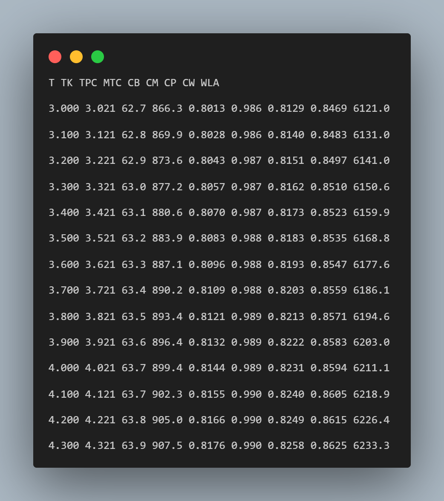
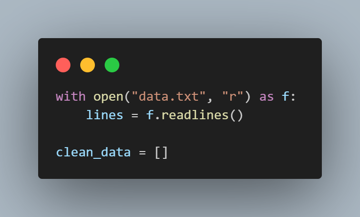
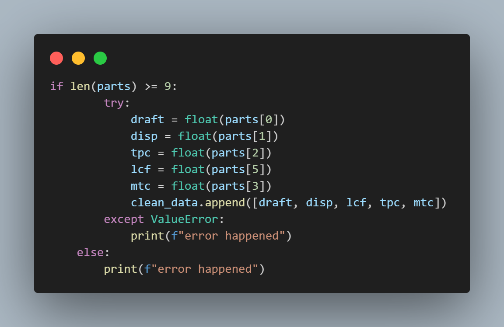
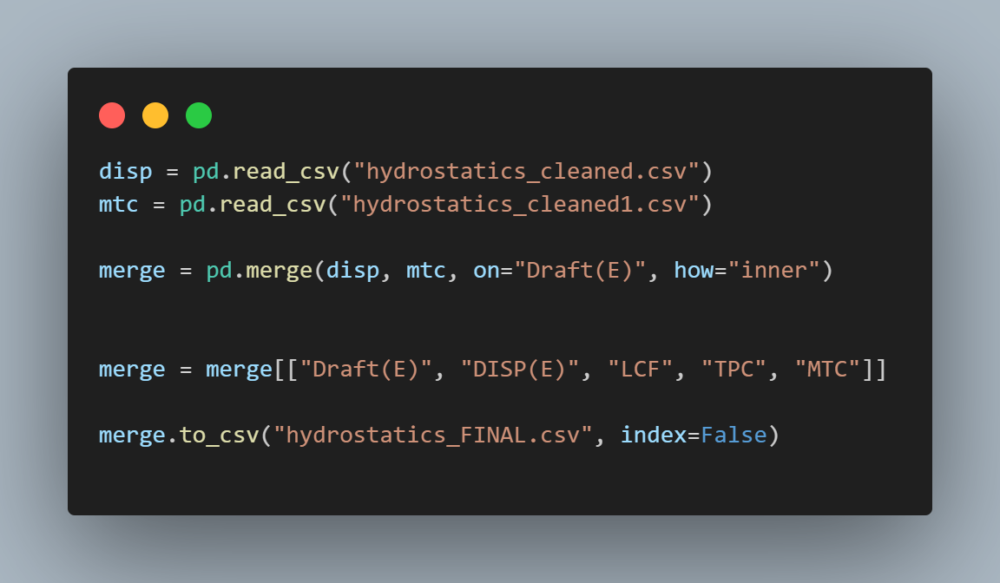
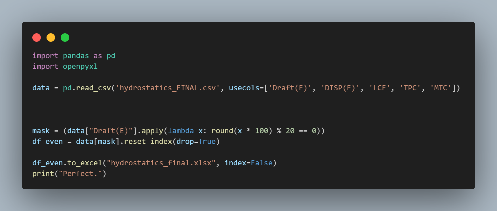

# How to Use

1. **Prepare Your Data**  
   Copy and paste your raw data (rows and columns) into `data.txt`.  
   Example:  
   

2. **Clean the Data**  
   Open and run `cleaner.py`. This converts your data into a ready-to-use `.csv` file.  
   

   - In `cleaner.py`, you can select which columns to keep in your CSV using their indexes:  
     

   - You can also rename the columns as you like. The cleaned data will be saved as a CSV file, which you can rename freely:  
     

3. **Merge Tables (if needed)**  
   If your data is split into different tables, use `final.py` to merge your CSV files into one:  
   

   - Repeat the cleaning process for each raw data set. You should end up with two (or more) CSV files.  
   - Paste their paths into `final.py` and run it. This will create a single, merged CSV file.

4. **Export to Excel**  
   Use `hydrofetcher.py` with your final CSV file.  
   - This script keeps only the rows with `.2` intervals and converts everything into a single Excel file:  
     

5. **Done!**  
   Your processed data is now ready in Excel format.